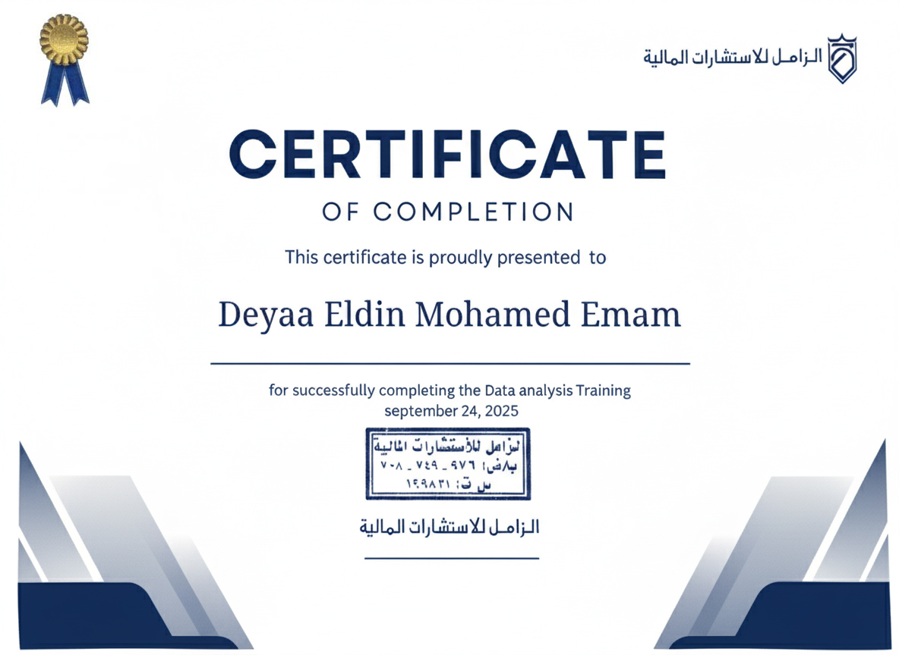
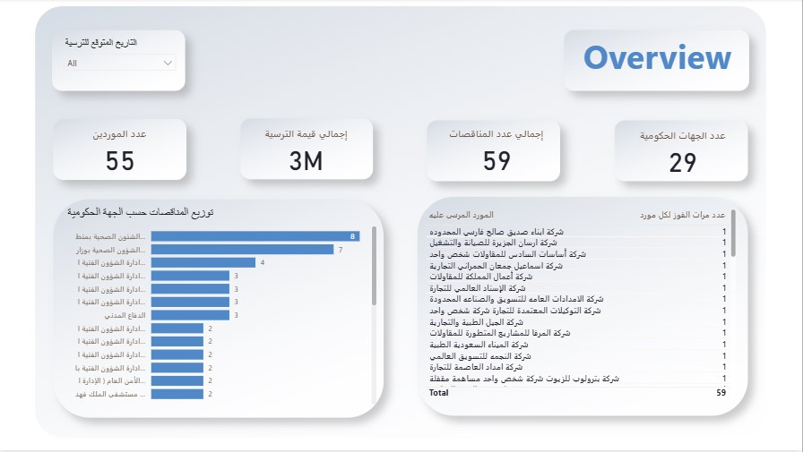

# 📊 Power BI: Government Procurement Analysis (Healthcare Sector)

**Final project for the Data Analysis Training at Al Zamil CPAs & Consultants (Aug-Sep 2025).**

This project transforms complex government procurement datasets into an actionable, insight-driven dashboard. The goal is to enhance clarity, transparency, and decision-making for stakeholders in the healthcare sector.

---

### 🛠️ Tools & Techniques

* **Tool:** Microsoft Power BI
* **Key Skills:** DAX, Data Modeling, UX/UI Dashboard Design, Advanced Filtering, Data Transformation (Power Query).

---

### 💡 Key Features & Dashboard Pages

I didn't just build charts — I built a multi-page, fully interactive system designed to answer real business questions through advanced logic and user-focused design.

#### 1. Overview Page: The Executive Compass 🧭
Provides an executive summary of the market size.
* Tracks Total Tender Value (~3M)
* Total Contract Count (59)
* Number of Agencies and Suppliers
* Immediately identifies the most active government clients by volume.

#### 2. Analysis of Government Agencies: The Financial Treasure Map 💰
This page reveals how the money is spent, identifying the highest spenders (Treemap) and comparing agency behavior based on total value vs. average contract value.

#### 3. Suppliers Analysis: The Competition Arena 🏆
A deep dive into the competition.
* Reveals the Most Winning Supplier and their market share (e.g., 50%).
* Ranks suppliers based on the average value of contracts won to clarify who secures the most profitable deals.

#### 4. Timeline Analysis: Seasonal Forecasting 🗓️
This page tells *when* to act. Line charts display seasonal trends in both tender value and volume, highlighting peak periods (e.g., March and September) crucial for resource planning.

#### 5. Table Filters: The Private Investigator 🔎
For quick auditing and verification, flexible filters allow users to rapidly isolate transactions based on date, value, or supplier/agency name, streamlining operational processes.

---

### 📂 Project Files

* **`.pbix` File:** You can download the complete Power BI report file (`AlZamil_Project.pbix`). **The data is embedded (imported) directly into this file**, allowing you to explore the data model, DAX measures, and interactive dashboard.
* **`Images/` Folder:** Contains all final dashboard screenshots (like `Overview.jpg`, `Suppliers Analysis.jpg`, etc.) **as well as screenshots of the raw data structure** (`page 1 of data.jpg`, `page 2 of data.jpg`) as the original Excel file is not public.

---

### 🙏 Acknowledgements
A heartfelt thank you to **Menna Mohamed** for her insightful advice and generous support throughout this project.
